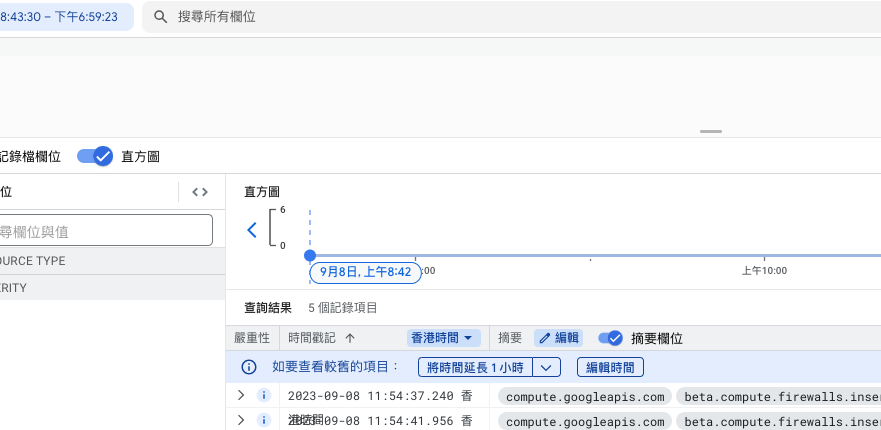

<h1> 輕鬆建置 GCP 雲端自動監控架構（以 Python 為例） </h1>

在這份指南中，主要希望引導使用者**簡單輕鬆**建立一個雲端監控系統，利用 Google Cloud Platform（GCP）的服務，包括 Cloud Function、Cloud Logging、Cloud Scheduler 和 Cloud Storage。我們的目標是幫助您自動監控雲基礎設施，專注於 **防火牆（Firewall）** 和 **實例（Instance）** 的安全性、資源優化以及使用情況追蹤。

<em>本篇以基本防護為主，深層資安問題將不做過多討論！</em>

- [前置條件](#前置條件)
    - [誰適合讀？](#誰適合讀)
- [專案概述](#專案概述)
  - [為什麼需要監控機制？](#為什麼需要監控機制)
  - [使用到哪些 GCP 服務](#使用到哪些-gcp-服務)
- [自動監控功能](#自動監控功能)
  - [防火牆監控機制](#防火牆監控機制)
    - [1. 建立 Logs Router](#1-建立-logs-router)
    - [2. 建立 Cloud Function](#2-建立-cloud-function)
  - [雲端實例監控機制](#雲端實例監控機制)
    - [更新檢測](#更新檢測)
      - [1. 建立 Logs Router](#1-建立-logs-router-1)
      - [2. 建立 Cloud Function](#2-建立-cloud-function-1)
    - [定期資源關閉](#定期資源關閉)
      - [1. Cloud Scheduler](#1-cloud-scheduler)
      - [2. Cloud Function](#2-cloud-function)
- [討論](#討論)

--- 
## 前置條件

**本章將不介紹如何使用免費版方案！！！**

因此以下提及的監控功能建立，都會**預設使用者已經使用 GCP 開啟專案，並且有足夠權限設定。**

#### 誰適合讀？

如果你是希望學習 GCP 服務的人，有 個人/團隊 資源監控考量的人，有基本雲端和 Python 概念的人，那麼你可以往下看看如何**簡單**管控 GCP 資源。

---
## 專案概述

### 為什麼需要監控機制？

若沒有自動化監控機制，在團隊中較難定義每個人所創建資源的狀況，若給訂一套創建模板，又會限縮團隊整體開發空間，因此**透過監控機制，能自動檢測團隊內每個人的資源使用狀況，並在有資安疑慮的情況下，自動提醒 Team Lead，如此能大幅減少資源濫用以及資安危機。**

### 使用到哪些 GCP 服務

監控的主要對象為 **防火牆（Firewall）** 和 **實例（Instance）** 的安全性，並主要透過以下服務做監控：

- **Cloud Function**：用於無伺服器、事件驅動的函數，監控基礎設施的變化。
  - 白話：在雲端的 Function，可以透過某些事件觸發來自動 Call 他。
- **Cloud Logging**：用於捕獲和儲存日誌以進行審計和分析。
  - 白話：就是 log，作為觸發 Function的事件。
- **Cloud Scheduler**：用於排程自動任務和檢查。
  - 白話：就是排程，例如每 3 分鐘做一件我們定義好的事情。
- **Cloud Storage**：用於儲存由我們的監控函數生成的數據和報告。
  - 白話：類似 google drive，就是存東西用的。

---
## 自動監控功能

規劃上，我們希望在專案內的所有 Compute Engine VM Instances 都處於安全狀態。因此針對防火牆、Instance 兩者的更動來做監管。

<details>
<summary><b>Compute Engine VM Instances 和 防火牆的基本概念</b></summary>
Compute Engine VM Instances 簡單來說就是一台雲端機器，最簡單的想像就是把你的電腦放在雲端上，接著可以在世界各地透過他的 IP 位址連到那台電腦。

假設那台電腦有足夠強的運算能力，我們就不用在自己家買一台超級電腦，只要用簡單的筆電就可以連到雲端的電腦，就可以輕鬆進行我們想要的運算。

詳細來說，可能要比上述介紹複雜許多，但姑且可以先想像成我們借了一台很強的機器在雲端上，並且可以在世界各地透過 IP 連到那台機器，大部分自己筆電能做的事情也都能在那台機器上完成。

而這台雲端上的電腦（機器）我們通常叫做 Instance。

而最可能有安全疑慮的就是 IP 位址，假設我們不做任何設定，那只要取得 Instance 的 IP 位址，任何人都有機會連上去，也就是說任何人都能在上面竊取資料、攻擊。

因此在 GCP 上，要幫 Instance 做的保護，就是在 Instance 上面架一層防火牆，讓連到機器的流量，先被防火牆過濾，就能做到最基礎簡單的保護。
</details>

### 防火牆監控機制

為了確保防火牆都有正確阻絕 IP，我們將在防火牆有任何建立、更新時，都做一次掃描，簡單掃描是否 IPv4 為「0.0.0.0」。
<em>後續 IPv6 或是其他條件可以由使用者自行設定</em>

**想法：在更新服務時會寫入 Log 中，我們將 Log 當作觸發條件，只要有 Log 到防火牆相關事件時，我們啟動 Cloud Function，針對該更新的防火牆進行檢測。**
#### 1. 建立 Logs Router

開啟 GCP 控制台 -> 選擇你的專案 -> 搜尋 cloud logging 

進入後可以看到進入後可以看到雲端服務所記錄的每個 Log。

</img>

*這邊我們簡單建立一個防火牆規則做示意，beta.compute.firewalls.insert 就是所記錄的 log。*

接著開始設定路由，主要希望「涵蓋特定資訊的 log 能夠藉由路由器傳導到我能觸發 cloud function 的位置」

打開左邊**紀錄檔路由器** -> 點選建立接收器 -> 輸入名字 -> 輸入接收器目標位置：Cloud Pub/Sub 主題（建立主題）-> 選擇要納入接收器的記錄檔（程式如下）-> 排除的紀錄檔（留白即可，後續需要可再調整）

```SQL
resource.type="gce_firewall_rule" AND (
protoPayload.methodName="v1.compute.firewalls.patch" AND
protoPayload.response.operationType="patch") OR (
protoPayload.methodName="beta.compute.firewalls.insert" AND
protoPayload.response.operationType="insert")
```
**納入接收器的記錄檔**主要是設定哪些 log 會被傳到我們設定的目標位置 Pub/Sub 主題。

這邊設定是當防火牆更新（v1.compute.firewalls.patch）或是建立防火牆（beta.compute.firewalls.insert）時，會把 log 傳到 Pub/Sub 以觸發 Cloud Function。

如此便完成一道紀錄路由器，能夠將我們需要的觸發條件收集起來啦！

#### 2. 建立 Cloud Function

觸發條件建立結束，接著只要設定 Cloud Function，當 Pub/Sub 主題接收到訊息時，觸發此 Function 即可。

搜尋「Cloud Functions」-> 建立函式 -> 基本設定：環境第一代、名字、地區 -> **觸發條件：Pub/Sub，和上述路由器設定同一個主題** 

接著下一步可以開始寫 Function 了，我們以 Python 為例：

1. 解析資料：將 `event` 透過 `base64` 解析成文字，在用 json 轉換成 dict：
```python
try:
    pubsub_message = base64.b64decode(event["data"]).decode("utf-8")
    json_content_msg = json.loads(pubsub_message)
    update_firewalls_name = json_content_msg["protoPayload"]["resourceName"].split("/")[-1]
except Exception as e:
    send_msg_to_your_organization(ORGANIZATION_URL, f"Parser event input error: {e}")
    print(f"Parser event input error: {e}")
```
注意：這邊發生問題時，我們不希望程式只將錯誤回報在 log 內，而是希望提醒我們程式發生問題，因此定義 `send_msg_to_your_organization()` 來做錯誤傳遞，這邊我們不實作此方法，可以透過常見的 email 或是其他通訊軟體時做此塊，若不需要也可直接刪除。

2. 取得防火牆資訊
   - computer：為 `googleapiclient` 物件，取得認證後可以逕行做雲端資源的操作。
   - firewalls_name：代表發生事件的防火牆名稱。
```python
def get_firewalls_status(computer, project_id, firewalls_name):
    try:
        request = computer.firewalls().list(project=project_id, filter=f"name={firewalls_name}")
        response = request.execute()
        if len(response["items"]) != 1:
            raise ValueError(f"len(response['items'])=={len(response['items'])} is not 1.")
        return response["items"]
    except Exception as e:
        send_msg_to_your_organization(ORGANIZATION_URL, f"List firewalls error: {e}")
        raise ValueError(f"List firewalls error: {e}")
```
由於我們以名稱作為篩選條件，因此希望**防火牆名稱不重複**，特別用 `len()` 來判斷是否有重複值。這裡回傳的 `response["items"]` 及代表名稱為 `firewalls_name` 的防火牆細節資訊。

3. 檢測 IP 異常
```python
def check_IP_valid(firewalls_info):
    try:
        if not isinstance(firewalls_info["sourceRanges"], list):
            firewalls_info["sourceRanges"] = [firewalls_info["sourceRanges"]]
        for IP_str in firewalls_info["sourceRanges"]:
            if IP_str.find("0.0.0.0") != -1:
                send_msg_to_your_organization(
                    ORGANIZATION_URL, f"Invalid Firewalls: {firewalls_info['name']}. IP: {IP_str} is found."
                )
                break
    except Exception as e:
        send_msg_to_your_organization(ORGANIZATION_URL, f"Get firewalls IP error: {e}")
        print(f"Get firewalls IP error: {e}")
```
這裡我們僅使用 「IP 是否為 0.0.0.0」 作為是否異常的資安判斷，各個專案可針對自己團隊的標準訂定客製化的檢測。

詳細程式碼位於[這邊](./gcp_firewalls_defend/main.py)，最後將進入點設為 `firewalls_update_detect` 即可。
### 雲端實例監控機制
#### 更新檢測

##### 1. 建立 Logs Router

與防火牆機制的建立流程相同，這裡我們一樣透過 log 判斷機器是否有「更新」的事件，其中路由器的納入接收器記錄檔程式我們設定：

```SQL
resource.type="gce_instance" AND (
protoPayload.methodName:"v1.compute.instances." ) OR (
protoPayload.methodName:"beta.compute.instances.") AND
protoPayload.response.operationType: *
```

排除的紀錄檔程式：
```SQL
protoPayload.methodName="v1.compute.instances.delete" OR 
protoPayload.methodName="v1.compute.instances.stop" 
```

*主要希望在刪除或停止的時候不要觸發程式，這裡可以看各個團隊或程式的管控方式。*

##### 2. 建立 Cloud Function

和防火牆相同，設定 Cloud Function，當 Pub/Sub 主題接收到訊息時，觸發此 Function 即可，觸發條件（Pub/Sub）也和 Router 的設定一致。

首先可以先透過簡單的文字處理，把 request 進來的事件做解析，得到「更新的機器名稱」，還有「機器所在區域」，以便後續快速查找。
```python
def parser_event_for_instance(event):
    try:
        pubsub_message = base64.b64decode(event["data"]).decode("utf-8")
        json_content_msg = json.loads(pubsub_message)
        source_details = json_content_msg["protoPayload"]["resourceName"]
        start_index = source_details.find("zones/") + 6
        end_index = source_details.find("/instance")
        this_zone = source_details[start_index:end_index]
        update_instances_name = source_details.split("/")[-1]
    except Exception as e:
        raise ValueError(f"Parser event input error: {e}")
    return this_zone, update_instances_name
```

我們透過 `filter` 將上述得到的名稱及區域做整個 project 內部的查找。
```python
def get_instance_information(this_zone, instance_name):
    try:
        instance_info = (
            COMPUTER.instances().list(project=PROJECT_ID, zone=this_zone, filter=f"name={instance_name}").execute()
        )
        if len(instance_info["items"]) != 1:
            raise ValueError(
                "Invalid number of instances got in monitoringInstances. Num of instance got: {len(instance_info['items'])}."
            )
        return instance_info["items"][0]
    except Exception as e:
        raise ValueError(f"Instance Update Monitoring Error: {e}")
```

最後定義想要針對「更新機器的規範檢查」就結束了！
這裡以檢查「是否有掛載防火牆」為例：
```python
if not instance_info["tags"].get("items"):
    print(
        f"GCP Instance without Internet Tags Error: \n - Instance ID: {instance_info['id']}.\n"
        f" - Instance area: {this_zone}.\n - Instance name: {instance_name}."
    )
    return
```
詳細程式碼位於[這邊](./gcp_instances_defend/main.py)，最後將進入點設為 `instances_update_detect` 即可。同樣的所有 `print` 可以改成 `raise error` 或 `send_msg_to_your_mail` 等等的方式掌握錯誤，甚至也能以同樣的方式在 log 增加錯誤訊息的路由器，以觸發 Cloud Function 傳送訊息回自身的信件夾中喔！

#### 定期資源關閉

最後，簡單透過定期關閉資源的方式，對於團隊來說也能方便做到節流！

*BTW，這套機制是由 AWS 搬到 GCP 的，因此並沒有使用 GCP 的一些原生方法，例如建立執行個體範本，群組等等，這些也都能簡單達到相同的效果！*

##### 1. Cloud Scheduler

搜尋 Cloud Scheduler，建立一套靜態排程，頻率可以自訂，以上班時間為例，可以設定成「* 18 * * 5」代表每週五下午六點整跑一次這個排程。其中頻率有五個位置能調整，依序是：分鐘、時刻、日、月、週。

排程的執行作業選擇「Pub/Sub」，後續透過此方式便可呼叫 Cloud Function。


##### 2. Cloud Function

這裡的程式也大同小異，基本上就是 1. 列出所有機器 2. 找到 Running 機器 3. 關機。

以上 3 點基本上也能同時做，因此這裡就不做過多贅述，有興趣可以參考[這邊](./gcp_autoshutdown/main.py)。

後續可以考慮的議題是，是否能夠僅在「每週的最後一個上班日執行」，由於台灣許多連假，因此有時未必是週五關機，可能遇到 228 有三天或四天連假，就會需要動態做調整。

其實只要能夠透過 [公開資料集](https://data.gov.tw/dataset/14718) 取得日曆的資訊，就可以每次動態調整下一次需要執行的時間。

例如週五先執行一次 scheduler ，而在 function 內自動 query 到下一次最後一個上班日（假設是 2月27號，禮拜四），因此我們會希望 scheduler 動態調整成「2月27號」執行。

可以透過 `google-cloud-scheduler` 套件提供的 `scheduler_v1.CloudSchedulerClient()` 模組，動態調整每一次的 scheduler 時間。例如：
```python
client = scheduler_v1.CloudSchedulerClient()
job_name = f"your_scheduler_name"
job = client.get_job(name=job_name)
job.schedule = f"00 18 {next_call_date} {next_call_month} *"
update_mask = field_mask_pb2.FieldMask(paths=["schedule"])
updated_job = client.update_job(job=job, update_mask=update_mask)
```

便可達到動態的更新排程～


---

## 討論

本篇介紹了許多 GCP 服務可以用於雲端監控，但如果你對 GCP 很熟了，可能會想問「既然是做雲端監控，那為什麼不用 cloud monitoring？」其實 GCP 原生就有許多資源可以幫助監控，**大可不必寫很多 Function**來監控資源，但基於擴展性，透過自訂義的方式，能夠管控更多的服務。而 cloud monitoring 也可以達到類似的效果做雲端服務的監控，並且他也整合好 UI 介面讓我們輕鬆操作，但**監控的標的物不同，會使得適用的服務不同。**

cloud monitoring 也能達到監控作用，但主要用於**動態指標**，例如「半個月內我的雲端機器的封包接收率」、「雲端機器的 CPU 使用率」、「防火牆阻絕封包率」等等，這些對於**資安層面的攻擊、監管、金費控制也有很大的幫助。**

但對於**靜態指標**而言，例如「雲端機器規格」、「IP 限制範圍」等等，就以本篇介紹的服務較為方便。

**就我本身所管理的團隊而言，兩種監控方式兼併使用，才能確保資安保護與雲端監控的最大化。**


